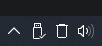
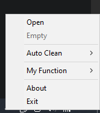

<div align="center">

# MiniBin

**Компактная Windows-утилита для управления Корзиной из системного трея.**


</div>

MiniBin работает в системном трее, показывает состояние Корзины одной из пяти иконок и позволяет быстро открыть или очистить Корзину. Ручная и автоматическая очистка также пытаются удалить содержимое пользовательской временной папки и `%WINDIR%\Temp`.

## Скриншоты

<div align="center">



<br><br>



</div>

## Возможности

- `Open` — открыть стандартную Корзину Windows.
- `Empty` — очистить Корзину без подтверждения, звука и окна прогресса.
- `Empty` автоматически становится недоступным, когда Корзина пуста.
- Двойной клик по значку MiniBin выполняет `Empty`, если в Корзине есть элементы.
- `Auto Clean`: `Off`, `30 min`, `1 hour`, `3 hour`.
- `My Function` — пустое зарезервированное подменю для пользовательских/разработческих расширений.
- Пять статических состояний иконки: `Empty`, `25%`, `50%`, `75%`, `Full`.
- Очистка `%TEMP%` и `%WINDIR%\Temp` вместе с ручной/автоматической очисткой.
- Настройки хранятся рядом с программой в `minibin.ini`.
- Портативная работа без установки.
- Нет персональных абсолютных путей, привязки к конкретному компьютеру или пользовательских сценариев.

## Главное меню

```text
Open
Empty
────────────
Auto Clean >
    Off
    30 min
    1 hour
    3 hour
────────────
My Function >
    (пусто)
────────────
About
Exit
```

## Быстрый запуск

1. Откройте раздел **Releases**.
2. Скачайте `MiniBin - 1.1.zip`.
3. Распакуйте архив в отдельную папку.
4. Запустите `MiniBin.exe`.
5. Не удаляйте файлы `empty.ico`, `25.ico`, `50.ico`, `75.ico`, `full.ico`: они используются значком в системном трее.

## Конфигурация

```ini
[Configure]
AutoCleanMinutes=0

[Display]
MaxFillSizeMB=1024
```

`AutoCleanMinutes` принимает `0`, `30`, `60` или `180`. `MaxFillSizeMB` задаёт условный объём, относительно которого выбираются состояния `25% / 50% / 75% / Full`.

## Важное замечание об очистке Temp

MiniBin удаляет то, что Windows разрешает удалить из `%TEMP%` и `%WINDIR%\Temp`. Заблокированные и защищённые файлы пропускаются. Для части системной временной папки могут потребоваться повышенные права.

## Сборка из исходников

Требуется Go 1.23 или новее. Проект не использует сторонние Go-модули.

```powershell
.\scripts\build_release.ps1
```

Подробности: [`docs/DEVELOPMENT_RU.md`](docs/DEVELOPMENT_RU.md).

## Добавление функций

Архитектура специально упрощена для расширения. `My Function` служит постоянной точкой для собственных функций и в публичной сборке 1.1 намеренно пуст.

- Назначение `My Function`: [`docs/MY_FUNCTION_RU.md`](docs/MY_FUNCTION_RU.md)
- Общее руководство по расширению: [`docs/ADDING_FUNCTIONS_RU.md`](docs/ADDING_FUNCTIONS_RU.md)

## Структура проекта

```text
MiniBin/
├── src/                  # исходный код приложения
├── assets/               # пять ICO-состояний
├── scripts/              # сборка релиза
├── docs/                 # эксплуатация и разработка
├── minibin.ini           # конфигурация по умолчанию
├── CHANGELOG.md
├── CONTRIBUTING.md
├── LICENSE
└── README.md
```

## Документация

- [Руководство пользователя](docs/USER_GUIDE_RU.md)
- [Архитектура](docs/ARCHITECTURE_RU.md)
- [Разработка и сборка](docs/DEVELOPMENT_RU.md)
- [My Function](docs/MY_FUNCTION_RU.md)
- [Добавление своих функций](docs/ADDING_FUNCTIONS_RU.md)
- [Release checklist](docs/RELEASE_CHECKLIST_RU.md)

## Лицензия

MIT. См. [`LICENSE`](LICENSE).

## Автор

**AlCkoNi**
